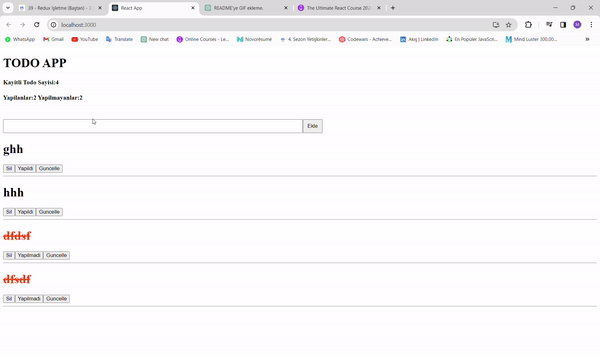

# TODO CRUD APPLICATION WITH REDUX

* In this project, I developed a todo application using Redux. I experienced the benefits that Redux provides to a developer. Most importantly, I was able to eliminate prop drilling. I dispatched the changes I made to the reducer, and the reducer passed these changes to the store, effectively updating the state. All components subscribed to the store automatically updated their states.

### ProjectGif

